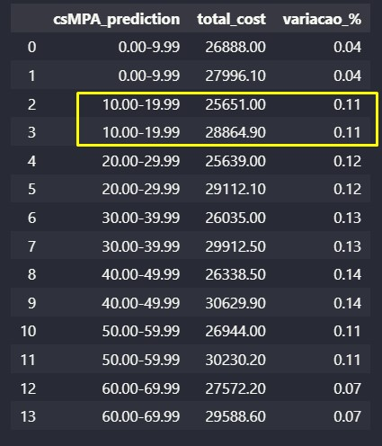

# Qualidade Concreto

Determinar a qualidade (dureza) do concreto atráves de seus componentes

## 1.	Problema de negócio
Uma construtora gostaria de medir a resistência do concreto baseando-se nas caracterisiticas disponíveis, ela depende dessa questão para construir nossos projetos e reduzir os custos envolvidos. Ainda existe uma certa dificuldade do time de engenheiros em confiar em um algoritmo de machine learning, então quanto mais acertivo for a previsão da dureza do concreto, mais confiabilidade a equipe de engenheiros terá para aceitar este tipo de solução aos seus projetos.

## 2.	Objetivo
Construir um modelo para prever a dureza do concreto para que o time de engenheiros possa utilizar essa solução para os novos projetos e conseguentemente reduzindo os custos envolvidos.

## 3.	Premissas do negócio
O custo unitário por cada componente é mostrado na tabela abaixo.

## 4.	Estratégia adotada para solução

Passo 1 - Descrição dos dados: O objetivo deste passo é ter um entendimento inicial de como os dados estão relacionados com o problema de negócio proposto, para tal, lançando mão de algumas métricas estatísticas de posição e distribuição.

Passo 2 - Engenharia de atributos: Neste passo foram criadas novas variáveis a partir das variáveis originais a fim de melhorar a qualidade dos dados facilitando seu o entendimento.

Passo 3 - Filtragem das variáveis: No processo de filtragem, busca-se selecionar e reter apenas as variáveis relevantes para a análise ou modelagem, com base nos objetivos do negócio e nas características do problema em questão.
 
Passo 4 - Análise exploratória: A análise exploratória dos dados (EDA) tem como principal objetivo proporcionar uma compreensão mais aprofundada dos dados, tais como: Compreender a distribuição das variáveis numéricas e categóricas, identificar outliers (valores atípicos), se existe desbalanceamento da variável resposta, correlações entre as variáveis entre outras análises.

Passo 5 - Preparação dos dados: Neste tópico, os dados serão transformados, ou seja, as variáveis categóricas serão convertidas em números, pois os algoritmos de machine learning não tem uma boa performance com dados não numéricos. Os dados também precisarão ser reescalados, ou seja, colocar as variáveis em uma escala comum.
 
Passo 6 - Seleção das variáveis: Neste passo o principal objetivo é selecionar as variáveis mais relevantes e descartar as menos importantes, para que estas sejam submetidas aos algoritmos de machine learning. Esta seleção é feita através de algoritmos específicos de seleção, com isso, busca-se reduzir a dimensionalidade dos dados sem perder em performance ao resultado final.

Passo 7 - Algoritmos de machine learning: Serão implementados alguns modelos de algoritmos de machine learning para possamos escolher o que melhor performou com os dados disponíveis.
 
Passo 8 - Ajuste dos hiperparâmetros: Com a definição do melhor modelo de machine learning, busca-se otimizar ainda mais a performance do modelo com alguns ajustes finos em seus parâmetros.

Passo 9 - Performance do negócio: Nesta etapa, o termo "performance do negócio" refere-se ao impacto que os modelos e análises têm nos resultados e metas de uma organização, pois busca garantir que as soluções propostas realmente tragam benefícios tangíveis para a empresa.

Passo 10 - Modelo em produção: Nesta etapa final, o melhor modelo treinado é implantado e usado em um ambiente operacional do mundo real. O objetivo principal deste passo de colocar um modelo em produção é transformar o trabalho de desenvolvimento de modelos em um sistema que pode fornecer valor contínuo e automático.

## 5.	Preparação dos dados
Considerando que os dados não seguem uma distribuição normal, foi decidido utilizar o método MinMaxScaler para normalizá-los e trazê-los para uma escala entre 0 e 1.

## 6.	Aplicação do modelo de machine learning
Foram feitos testes com vários algoritmos de machine learning, utilizando a técnica de cross-validation e ajuste fino dos parâmetros.

## 7.	Performance do modelo de machine learning
O algoritmo de machine learning escolhido foi o GradientBoostingRegressor.

## 8.	Resultado do negócio
Conforme simulação do projeto, os custos totais de cada faixa de dureza do concreto foram tabeladas conforme abaixo.

Na tabela abaixo, são apresentadas as diferenças percentuais entre os valores de csMPA correspondentes a cada intervalo. Por exemplo, para a faixa entre 10.00-19.99 de csMPA, os custos variam de 25651,00 a 28864,90, resultando em uma diferença de 11% entre o maior e o menor valor de custo. Este padrão é seguido para os demais intervalos.

## 9.	Conclusão
Ao enfrentar o desafio de desenvolver um modelo de machine learning para prever a resistência do concreto, fica evidente a importância crucial desse aspecto na construção civil. A resistência do concreto não só determina a qualidade das estruturas, mas também influencia diretamente sua durabilidade e segurança. Compreender os componentes individuais do concreto, como cimento, escarpa, cinzas volantes, água, superplastificante, agregado graúdo, agregado fino e idade do concreto, revela-se essencial para tomar decisões informadas durante o processo de mistura e aplicação.
Além disso, a análise das diferenças percentuais entre os valores de resistência do concreto em diferentes faixas oferece insights valiosos sobre a variabilidade dos custos associados à construção. Essa compreensão detalhada pode guiar a otimização de recursos e a identificação de oportunidades de economia, contribuindo para a eficiência geral dos projetos.

## 10.	Próximos passos
•	Refazer a previsão utlizando outros metódos de transformação dos dados;
•	Testar outros algoritmos de machine learning;
•	Buscar novas variáveis para definir melhor o comportamento das durezas;
•	Implementar o deploy em ambiente cloud utilizando o GCP.

